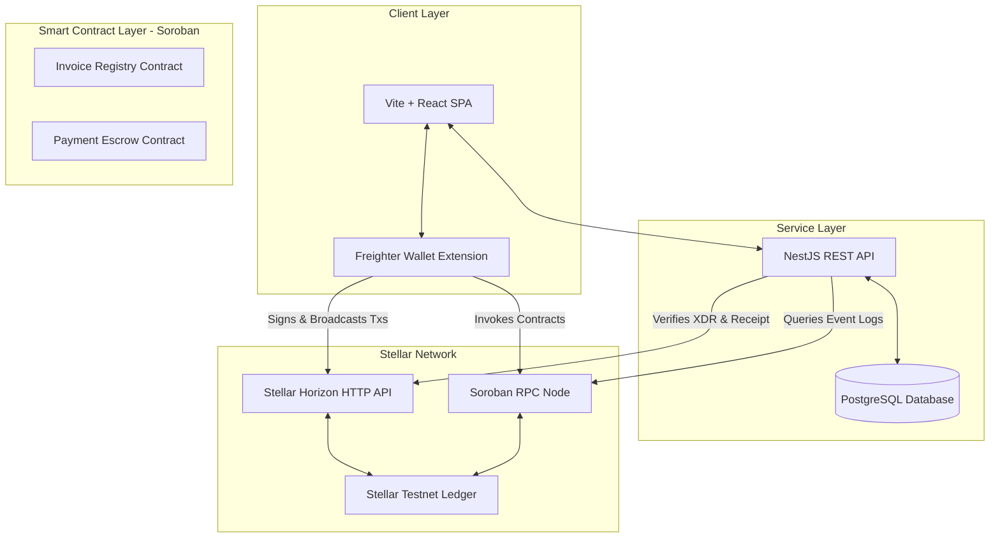
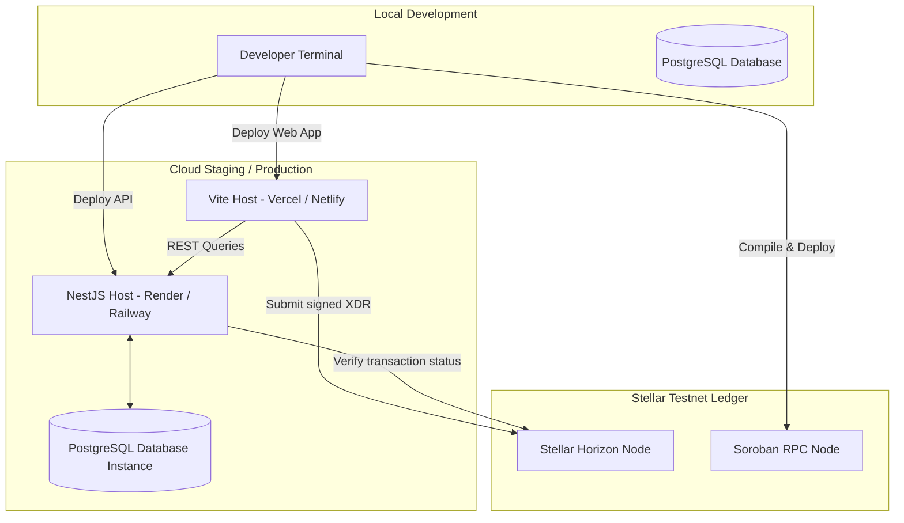
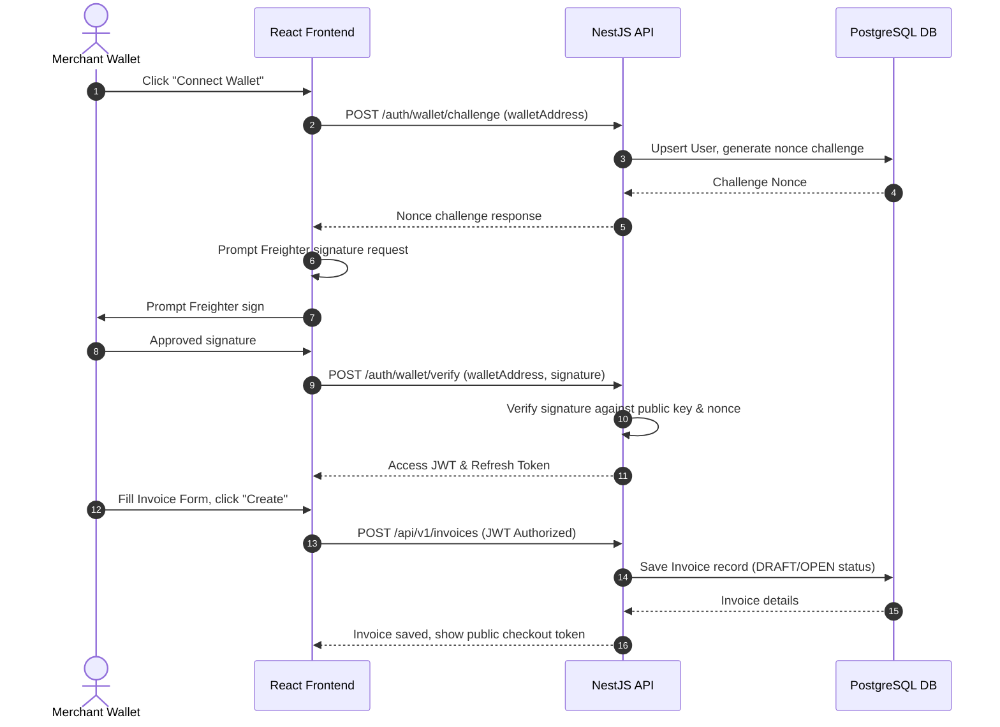
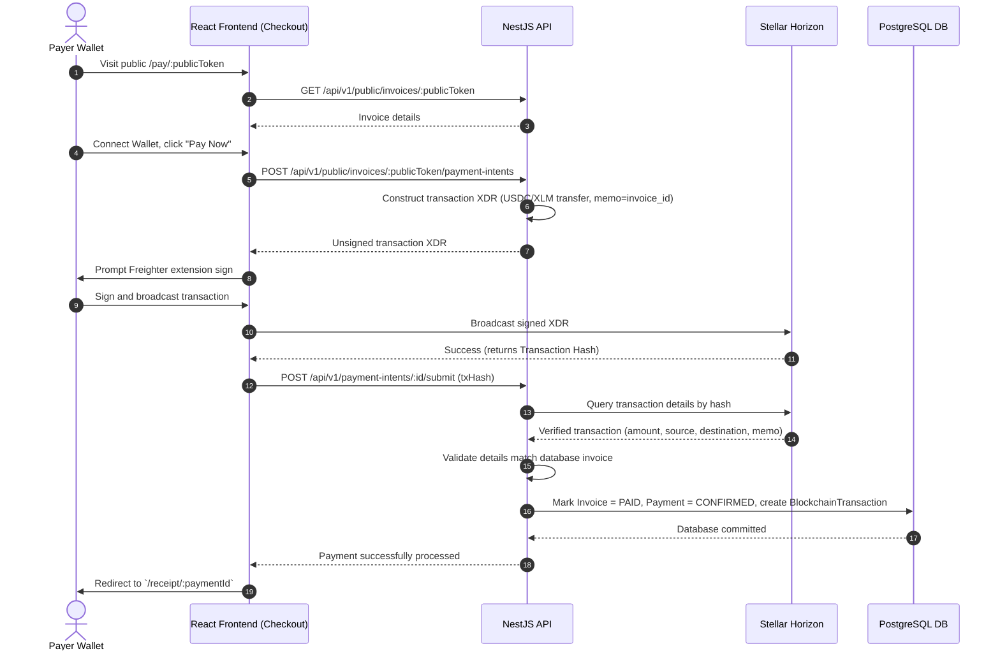
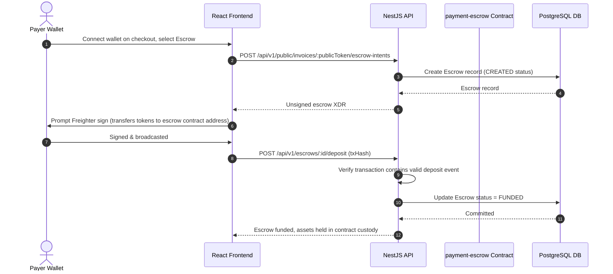
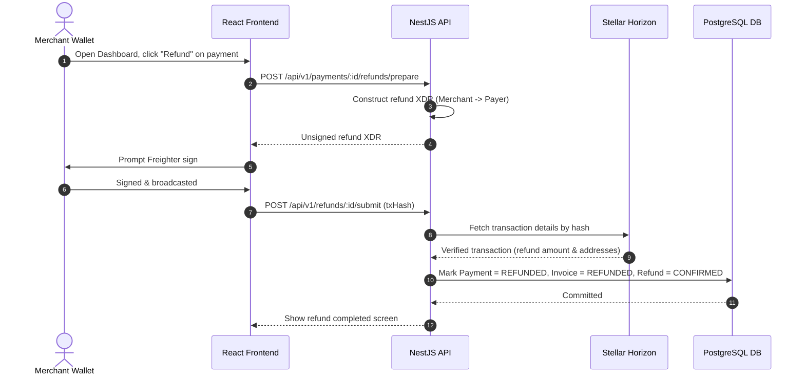
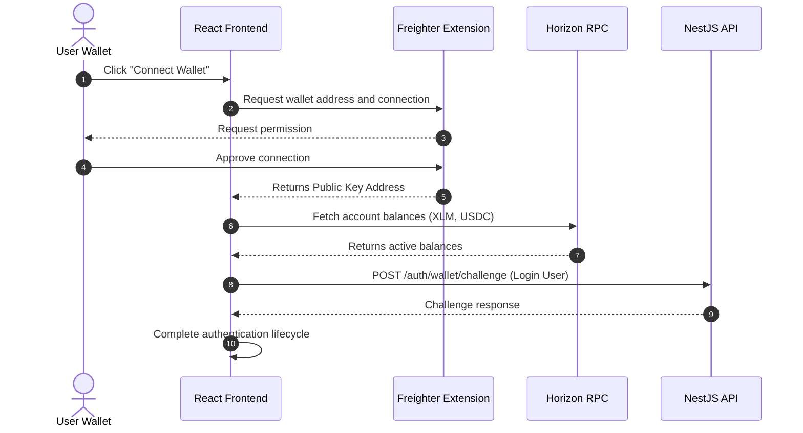

# <div align="center">Lumora Pay</div>

<div align="center">
  
</div>

<div align="center">
  <h3>Secure Non-Custodial Invoice Payment Infrastructure and Escrow Settlement on Stellar Soroban</h3>
  <p>Wallet-Signed XDR Payments  Verified Refund Processing  Secure Soroban Escrows  Automated Invoice Registry</p>
</div>

<div align="center">

[](https://github.com/TheAnh1404/LumoraPay)
[](https://github.com/TheAnh1404/LumoraPay/releases)
[](#17-license)
[](https://www.typescriptlang.org/)
[](https://react.dev/)
[](https://nodejs.org/)

[](https://stellar.org/)
[](https://soroban.stellar.org/)
[](https://github.com/TheAnh1404/LumoraPay/pulls)
[](https://stellar.org/events)
[](#11-protocol-security-architecture)

</div>

---

##  Table of Contents

- [1. Project Overview](#1-project-overview)
  - [Problem Statement](#problem-statement)
  - [The Lumora Solution](#the-lumora-solution)
  - [Core Value Proposition](#core-value-proposition)
- [2. Screenshots \& UI Gallery](#2-screenshots--ui-gallery)
- [3. System Architecture](#3-system-architecture)
  - [Overall System Architecture](#overall-system-architecture)
  - [Component Architecture](#component-architecture)
  - [Deployment Infrastructure](#deployment-infrastructure)
- [4. Protocol Business Flow](#4-protocol-business-flow)
  - [4.1 Invoice Generation \& Wallet Authentication](#41-invoice-generation--wallet-authentication)
  - [4.2 Payment Intent \& Checkout Lifecycle](#42-payment-intent--checkout-lifecycle)
  - [4.3 Soroban Escrow Deposit Flow](#43-soroban-escrow-deposit-flow)
  - [4.4 Verified Refund Flow](#44-verified-refund-flow)
  - [4.5 Wallet Connection \& Auth Flow](#45-wallet-connection--auth-flow)
- [5. Project Directory Structure](#5-project-directory-structure)
- [6. Technology Stack](#6-technology-stack)
- [7. Feature Matrix](#7-feature-matrix)
- [8. Smart Contracts (Soroban / Rust)](#8-smart-contracts-soroban--rust)
  - [Crate Overview](#crate-overview)
  - [Contract Responsibilities \& Core Functions](#contract-responsibilities--core-functions)
  - [Contract Interactions Matrix](#contract-interactions-matrix)
- [9. Database Schema (PostgreSQL / Prisma)](#9-database-schema-postgresql--prisma)
  - [Entity-Relationship Diagram](#entity-relationship-diagram)
  - [Data Model Reference](#data-model-reference)
- [10. API Documentation (NestJS REST Layer)](#10-api-documentation-nestjs-rest-layer)
- [11. Protocol Security Architecture](#11-protocol-security-architecture)
- [12. Installation \& Quick Start](#12-installation--quick-start)
  - [Prerequisites](#prerequisites)
  - [1. Smart Contracts Setup](#1-smart-contracts-setup)
  - [2. Backend Configuration](#2-backend-configuration)
  - [3. Frontend Configuration](#3-frontend-configuration)
  - [4. Database Migration \& Seeding](#4-database-migration--seeding)
- [13. Environment Variables](#13-environment-variables)
- [14. Smart Contract Deployments](#14-smart-contract-deployments)
- [15. Protocol Roadmap](#15-protocol-roadmap)
- [16. Contributing](#16-contributing)
- [17. License](#17-license)

---

## 1. Project Overview

### Problem Statement

Existing online billing and checkout platforms (like Stripe, PayPal, or custodial crypto gateways) suffer from major systemic inefficiencies:

1. **High Transaction Fees:** Credit card processing fees and cross-border currency conversions eat into merchant margins (often 1.5% to 3.5% + fixed fees).
2. **Chargeback Fraud Risk:** Traditional payment systems permit retrospective chargebacks, placing the financial burden of fraudulent disputes entirely on merchants.
3. **Custodial Dependencies & Latency:** Custodial payment gateways hold funds before payouts, resulting in multi-day settlement delays and operational counterparty risks.
4. **Lack of Automated Trustless Escrows:** E-commerce payments lack secure, transparent escrow mechanisms where payment settlement is tied to verifiable execution without intermediate escrow agents.

### The Lumora Solution

Lumora Pay is a **secure, non-custodial billing and escrow protocol** built on the **Stellar Testnet** and **Soroban smart contracts**. It enables merchants to issue invoices, receive direct wallet-signed payments, and settle transactions with real-time on-chain confirmation.

```
                                  
    Merchant       Generate Invoice (Open status) >                  
                                    Invoice Registry   
                                                      (On-Chain Verification)
  Sign & Submit XDR >                  
    Payer         < Transfer Assets Directly to Merchant 

```

* **Non-Custodial Design:** Lumora Pay never accesses or stores private keys. Payers sign transactions directly in the Freighter browser extension, and funds move directly from the payer's wallet to the merchant's address.
* **On-Chain Invoice Registry:** Invoices are registered on-chain inside the `invoice-registry` contract, ensuring verifiable, immutable billing history.
* **Trustless Escrow Agreements:** Transactions demanding cargo delivery or milestones use the `payment-escrow` contract. Payer deposits are held directly in contract custody, automatically distributing funds to the merchant on release, issuing a refund on deadline expiration, or locking assets in a dispute pending admin resolution.
* **Cryptographically Verified Refunds:** Merchants can initiate refunds directly from the dashboard, generating a signed refund XDR that is broadcast to the network and verified before updating local databases.

### Core Value Proposition

* **Merchants:** Instantly generate invoices, manage customers, verify payments, execute refunds, and utilize escrow contracts.
* **Payers:** Securely pay invoice checkout links using native Freighter wallets, benefiting from Stellar's gas efficiency and near-instant settlement.
* **Admins/Arbitrators:** Oversee dispute resolutions within isolated escrow instances by splitting balances on-chain.
* **Developers:** Access structured API endpoints, transaction trackers, contract health services, and test sandbox utilities.

---

## 2. Screenshots & UI Gallery

<p align="center">
  
  <br />
  <em>Figure 1: Merchant Portfolio Dashboard displaying revenue analytics, invoice statistics, recent transactions, and wallet balances.</em>
</p>

<details>
<summary> Expand to View Full Gallery</summary>

###  Invoices Management
<p align="center">
  
  <br />
  <em>Create, search, filter, duplicate, and cancel customer invoices from a unified data grid.</em>
</p>

###  Public Invoice Checkout
<p align="center">
  
  <br />
  <em>Public checkout view displaying invoice requirements, generating payment QR codes, and providing direct Freighter integration.</em>
</p>

###  Payment Receipt & Telemetry
<p align="center">
  
  <br />
  <em>Post-checkout confirmation receipt displaying transaction hash, ledger number, fees paid, and direct Stellar Expert block explorer links.</em>
</p>

###  Settings & Pilot Evidence
<p align="center">
  
  <br />
  <em>Manage merchant profiles and review Level 4 production MVP audit trails (wallet interaction proofs, feedback collection forms).</em>
</p>

</details>

---

## 3. System Architecture

Lumora Pay implements a robust three-tier architecture connecting React, NestJS, and PostgreSQL with the Stellar network and Soroban RPC nodes.

### Overall System Architecture



### Component Architecture

```mermaid
graph LR
    subgraph ClientComponents [Frontend React Client]
        Zustand[Zustand Stores]
        Freighter[@stellar/freighter-api]
        SDK[@stellar/stellar-sdk]
        Pages[React Pages / Views]
    end

    subgraph BackendComponents [Backend NestJS Service]
        Auth[Wallet Challenge & JWT Auth]
        Prisma[Prisma Client ORM]
        Controllers[API Routers & Controllers]
        StellarSvc[Stellar & Horizon Services]
    end

    subgraph SorobanContracts [Soroban Rust Crate Workspace]
        InvReg[invoice-registry contract]
        PayEsc[payment-escrow contract]
    end

    Pages --> Zustand
    Zustand --> Freighter
    Zustand --> SDK
    Zustand --> Controllers
    Controllers --> Auth
    Controllers --> StellarSvc
    Controllers --> Prisma
    StellarSvc -- "RPC Queries" --> SorobanContracts
```

### Deployment Infrastructure



---

## 4. Protocol Business Flow

All operations that alter the state of an invoice or payment are cryptographically verified off-chain. The database is updated only after verifying the transaction hash on Stellar.

### 4.1 Invoice Generation & Wallet Authentication



### 4.2 Payment Intent & Checkout Lifecycle



### 4.3 Soroban Escrow Deposit Flow



### 4.4 Verified Refund Flow



### 4.5 Wallet Connection & Auth Flow



---

## 5. Project Directory Structure

```filepath
LumoraPay/
 .github/
    workflows/             # GitHub CI/CD workflow configurations
       ci.yml             # Test, build, and deploy pipeline
 backend/                   # NestJS REST server
    prisma/                # Prisma ORM schemas and migrations
       migrations/        # SQL migration files
       schema.prisma      # PostgreSQL models
       seed.ts            # Seeds database with mock profiles and deployments
    src/                   # NestJS source code
       auth/              # Challenge generation, JWT strategy, sign verification
       common/            # Exception filters, pagination DTOs, interceptors
       config/            # Environment configurations (stellar.config)
       contracts/         # Soroban contracts health check and configuration endpoints
       customers/         # Customer profiles REST management
       escrows/           # Soroban escrow preparer & receipt processors
       health/            # Database and Stellar Horizon health controllers
       invoices/          # Invoice management and public payments Router
       merchants/         # Merchant profiles dashboard endpoints
       payments/          # Payment intents builder and confirmation receipt validations
       pilot/             # Level 4 pilot analytics logging and feedback API
       prisma/            # PrismaClient wrapper service
       stellar/           # Horizon and Friendbot ledger integrations
       wallets/           # Stellar blockchain transaction history fetchers
       main.ts            # NestJS app bootstrapper
    tsconfig.json          # TypeScript configuration
    package.json           # Backend npm dependency manifests
 contracts/                 # Cargo workspace for Soroban Rust smart contracts
    Cargo.toml             # Cargo workspace manifest
    contracts/
       invoice-registry/   # Invoice tracking registry smart contract
          src/             # Contract source files (lib, admin, storage, types, errors)
       payment-escrow/     # Fund custodian contract holding deposits, releases, refunds, disputes
          src/             # Contract source files (lib, admin, storage, types, errors, escrow_ops)
 docs/                      # Architectural audits, E2E checklists, and runbooks
 scripts/                   # Workspace automation utilities
    deploy-contracts-testnet.ps1  # Compiles and deploys WASM files to Testnet
    test-full-integration.ts      # TypeScript integration client verifying endpoints
```

---

## 6. Technology Stack

Lumora Pay is built using modern Web3 frameworks, ensuring end-to-end type safety:

| Layer | Technology | Version | Purpose |
| :--- | :--- | :--- | :--- |
| **Frontend** | [React](https://react.dev/) | `^19.1.0` | UI rendering framework |
| | [Vite](https://vite.dev/) | `^6.3.5` | Next-generation bundler and dev server |
| | [Ant Design](https://ant.design/) | `^5.25.3` | Professional UI component library |
| | [Tailwind CSS](https://tailwindcss.com/) | `^4.1.8` | Utility-first CSS engine |
| | [Zustand](https://github.com/pmndrs/zustand) | `^5.0.5` | High-performance state store |
| | [React Hook Form](https://react-hook-form.com/) | `^7.56.4` | Structured form validation |
| | [@stellar/freighter-api](https://www.freighter.app/) | `^3.1.0` | Freighter browser extension connector |
| | [TypeScript](https://www.typescriptlang.org/) | `~5.8.3` | Strict type compiler |
| **Backend** | [NestJS](https://nestjs.com/) | `^11.0.1` | Modular Node.js framework |
| | [Prisma ORM](https://www.prisma.io/) | `^6.9.0` | SQL data mapper and migrations tool |
| | [Passport JWT](http://www.passportjs.org/) | `^11.0.5` | Token-based middleware protection |
| | [@stellar/stellar-sdk](https://github.com/stellar/js-stellar-sdk) | `^13.1.0` | XDR creator and Horizon interface |
| | [Helmet](https://helmetjs.github.io/) | `^8.1.0` | Express security middleware |
| **Smart Contracts** | [Rust](https://www.rust-lang.org/) | `2021 Edition` | Memory-safe smart contracts |
| | [Soroban SDK](https://soroban.stellar.org/) | `22.0.4` | Smart contract framework for Stellar |
| **Database** | [PostgreSQL](https://www.postgresql.org/) | `16` | Relational application database |
| **DevOps & QA** | [Oxlint](https://github.com/oxc-project/oxc) | `^1.1.0` | High-performance JavaScript linter |

---

## 7. Feature Matrix

###  Wallet Integration & Auth
*   **Freighter Handshake:** Detect connection, handle network passphrase errors.
*   **Nonce-Based Signature Challenges:** Prevent replay attacks through server-generated nonces verified via ed25519 signature checks.
*   **JWT Sessions:** Secure HTTP state management with local storage session tokens.
*   **Friendbot Faucet Integration:** Developer sandbox wallet funding via Horizon's Friendbot client.

###  Invoice Portal & Payments
*   **Structured Invoice Creator:** Interactive form supporting description, amount, due dates, currency, and customer assignments.
*   **Checkout QR Code Generator:** Renders direct scan-to-pay codes containing payment endpoints.
*   **Unsigned XDR Constructor:** Automatically builds payment transaction envelopes containing correct destinations, amounts, and memos.
*   **Horizon Transaction Verification:** Double-checks payment transaction hashes on Stellar Horizon before altering database invoice status.

###  Refund Engine
*   **Signed XDR Refund Process:** Builds refund operations directly in the backend to ensure payment consistency.
*   **Merchant Authorizations:** Restricts refund creation to invoice owners.
*   **Stellar Receipt Logging:** Stores refund tx hashes, ledger indices, and fee metrics.

###  Soroban Escrow Settlement
*   **On-Chain Deposits:** Custodies XLM or USDC tokens in an isolated escrow contract instance.
*   **Dual-Auth Refund Logic:**
    *   *Before deadline:* Escrow can only be refunded if the merchant explicitly approves.
    *   *After deadline:* Payer can trigger the refund on-chain independently.
*   **Dispute Arbitration:** Locks disputed funds on-chain, allowing admin to split and resolve.
*   **Platform Fee Snapshotting:** Captures current platform fees at escrow creation to prevent post-creation fee hikes.

###  Pilot Analytics & Observability
*   **Telemetry Tracker:** Client-side event capturing for page performance and error logging.
*   **Interaction Verification:** Audit log storing wallet connect/disconnect actions, signed XDR actions, and transaction inputs.

---

## 8. Smart Contracts (Soroban / Rust)

### Crate Overview

The Rust workspace houses two main smart contracts configured under `contracts/Cargo.toml`. They use the Soroban environment to provide verifiable, non-custodial execution:

```
                  
                    invoice-registry 
                  
                             
            Create Invoice        Mark Paid/Refunded
            (Merchant Auth)       (Admin Auth)
                             
         Logical Association (Off-Chain Coordination)
            payment-escrow         
                           
                                                                  
            Escrow Deposits                               Payer Release
            (Payer Auth)                                  (Payer Auth)
                                                         
                  
                  Dispute Resolution / Splits    
                  (Admin Auth)
```

---

### Contract Responsibilities & Core Functions

#### 1. Invoice Registry Contract (`contracts/invoice-registry`)
Provides an on-chain ledger to track billing statuses and payment proofs.

*   `initialize(env, admin: Address)`: Configures the registry owner (admin). Can only be invoked once.
*   `create_invoice(env, invoice_id: BytesN<32>, merchant: Address, customer: Option<Address>, token: Address, amount: i128, metadata_hash: BytesN<32>, due_at: u64)`: registers a new invoice in the `Open` state. Fails if the amount is negative or if the invoice already exists. Requires merchant auth.
*   `cancel_invoice(env, invoice_id: BytesN<32>)`: Cancels an open invoice. Requires merchant auth.
*   `mark_paid(env, invoice_id: BytesN<32>, payment_reference: BytesN<32>)`: Marks invoice paid on-chain and stores the transaction reference. Requires admin auth.
*   `mark_refunded(env, invoice_id: BytesN<32>, refund_reference: BytesN<32>)`: Transitions a paid invoice to refunded state. Requires admin auth.
*   `get_invoice(env, invoice_id: BytesN<32>)`: Reads invoice parameters.
*   `get_admin(env)`: Returns the registry admin address.

#### 2. Payment Escrow Contract (`contracts/payment-escrow`)
Manages escrow deposits, payouts, refunds, and dispute arbitration.

*   `initialize(env, admin: Address, fee_recipient: Address, platform_fee_bps: u32)`: Sets configuration parameters (maximum platform fee: `10,000` bps = 100%).
*   `create_escrow(env, escrow_id: BytesN<32>, invoice_id: BytesN<32>, payer: Address, merchant: Address, token: Address, amount: i128, release_deadline: u64)`: Registers a new escrow record in the `Created` state.
*   `deposit(env, escrow_id: BytesN<32>)`: Transfers the requested tokens from the payer's address into contract custody. Requires payer auth. Transitions status to `Funded`.
*   `release(env, escrow_id: BytesN<32>)`: Transfers platform fees to the fee recipient and the remaining balance to the merchant. Requires payer auth. Transitions status to `Released`.
*   `refund(env, escrow_id: BytesN<32>)`: Returns all held tokens to the payer.
    *   *If the deadline has passed:* Payer can execute directly.
    *   *If the deadline is active:* Requires merchant auth.
*   `open_dispute(env, escrow_id: BytesN<32>, evidence_hash: BytesN<32>)`: Escalates a funded escrow to `Disputed`. Requires payer auth.
*   `resolve_dispute(env, escrow_id: BytesN<32>, merchant_amount: i128, payer_amount: i128)`: Divides the remaining escrow balance between the merchant and the payer. Requires admin auth. Transitions status to `Resolved`.
*   `get_escrow(env, escrow_id: BytesN<32>)`: Reads escrow details.
*   `get_balance(env, escrow_id: BytesN<32>)`: Returns the remaining contract balance.

---

### Contract Interactions Matrix

Although the contracts do not make direct on-chain cross-contract calls, they are connected off-chain by the NestJS indexer and receipt processor.

| User Role | Contract | Invoked Function | Purpose |
| :--- | :--- | :--- | :--- |
| **Merchant** | `InvoiceRegistry` | `create_invoice` | Creates and signs an invoice |
| **Merchant** | `InvoiceRegistry` | `cancel_invoice` | Cancels a draft/unpaid invoice |
| **Admin** | `InvoiceRegistry` | `mark_paid` | Updates status upon verifying transaction hash |
| **Admin** | `InvoiceRegistry` | `mark_refunded` | Updates status after verifying merchant refund XDR |
| **Payer** | `PaymentEscrow` | `deposit` | Locks invoice amount into escrow contract |
| **Payer** | `PaymentEscrow` | `release` | Releases funds to merchant (minus platform fee) |
| **Payer/Merchant**| `PaymentEscrow` | `refund` | Returns funds to payer (requires merchant or expiration auth) |
| **Payer** | `PaymentEscrow` | `open_dispute` | Escalates contract state to resolve conflicts |
| **Admin** | `PaymentEscrow` | `resolve_dispute` | Distributes split funds to parties |

---

## 9. Database Schema (PostgreSQL / Prisma)

The database cache accelerates query performance. State updates are committed to the database only after confirmation on the Stellar blockchain.

### Entity-Relationship Diagram

```
         1:1                     1:N
   User   ───>  Merchant  ───>  Customer 
    │              │               │
    │ 1:N          │ 1:N           │ 1:N
    ├─> WalletBal  └──────┬───────>┴──> Invoice
    ├─> AuditLog          │                │
    ├─> PilotEvent        │                │ 1:N
    ├─> TxHistory         │                ├──> Payment ──> Refund
    ├─> EscrowPayer       │                │     │ 1:1       │ 1:1
    └─> EscrowMerch       └────────────────┼────>┼───────────┤
                                           v     v           v
                                   BlockchainTransaction (Audit Record)
```

---

### Data Model Reference

<details>
<summary> Click to View Prisma Model Fields</summary>

#### `User`
*   `id`: String (PK, cuid)
*   `walletAddress`: String (Unique index, public key)
*   `nonce`: String (Challenge challenge)
*   `displayName`: String (Optional profile label)
*   `createdAt` & `updatedAt`: DateTime

#### `Merchant`
*   `id`: String (PK, cuid)
*   `userId`: String (FK referencing `User`)
*   `businessName`: String (Merchant business title)
*   `businessEmail` & `webhookUrl` & `apiKey`: String (Optional configs)
*   `isActive`: Boolean (Active state, default: true)
*   `createdAt` & `updatedAt`: DateTime

#### `Customer`
*   `id`: String (PK, cuid)
*   `merchantId`: String (FK referencing `Merchant`)
*   `name` & `email`: String (Customer profiles)
*   `walletAddress`: String (Customer public key)
*   `notes`: String (Optional annotation metadata)
*   `createdAt` & `updatedAt`: DateTime

#### `Invoice`
*   `id`: String (PK, cuid)
*   `merchantId`: String (FK referencing `Merchant`)
*   `customerId`: String (FK referencing `Customer`, optional)
*   `publicToken`: String (Unique random checkout slug)
*   `invoiceNumber`: String (Merchant billing identifier)
*   `amount`: Decimal (Precision 20, Scale 7)
*   `currency`: String (Default: "XLM")
*   `status`: Enum (`DRAFT`, `OPEN`, `PAID`, `CANCELLED`, `REFUNDED`, `OVERDUE`, `PARTIALLY_PAID`)
*   `dueDate` & `paidAt`: DateTime
*   `memo`: String (Memo invoice descriptor)
*   `metadata`: Json (Custom integration values)
*   `createdAt` & `updatedAt`: DateTime

#### `Payment`
*   `id`: String (PK, cuid)
*   `invoiceId`: String (FK referencing `Invoice`)
*   `payerWallet` & `merchantWallet`: String
*   `amount`: Decimal (Precision 20, scale 7)
*   `currency`: String
*   `status`: Enum (`PENDING`, `PROCESSING`, `SUBMITTED`, `CONFIRMED`, `FAILED`, `EXPIRED`, `REFUNDED`, `PARTIALLY_REFUNDED`)
*   `transactionHash`: String (Stellar transaction hash, Unique)
*   `stellarMemo`: String (Verified invoice memo identifier)
*   `unsignedXdr` & `signedXdr`: String (XDR templates)
*   `submittedAt` & `confirmedAt`: DateTime
*   `failureReason`: String
*   `createdAt` & `updatedAt`: DateTime

#### `Refund`
*   `id`: String (PK, cuid)
*   `paymentId`: String (FK referencing `Payment`)
*   `amount`: Decimal (Precision 20, scale 7)
*   `currency`: String
*   `status`: Enum (`PENDING`, `PROCESSING`, `SUBMITTED`, `CONFIRMED`, `FAILED`)
*   `reason` & `transactionHash` & `unsignedXdr` & `signedXdr`: String
*   `processedAt` & `createdAt` & `updatedAt`: DateTime

#### `Escrow`
*   `id`: String (PK, cuid)
*   `invoiceId`: String (FK referencing `Invoice`, optional)
*   `payerUserId` & `merchantUserId`: String (FKs referencing `User`)
*   `tokenAddress`: String (Asset identifier)
*   `amount`: Decimal (Escrow balance, precision 20, scale 7)
*   `status`: Enum (`CREATED`, `FUNDED`, `RELEASED`, `REFUNDED`, `DISPUTED`, `RESOLVED`)
*   `contractEscrowId`: String (Soroban contract instance link, Unique)
*   `depositTxHash` & `releaseTxHash` & `refundTxHash`: String
*   `disputeReason`: String
*   `resolutionMerchantAmount` & `resolutionPayerAmount`: Decimal
*   `createdAt` & `updatedAt`: DateTime

#### `BlockchainTransaction`
*   `id`: String (PK, cuid)
*   `userId`: String (FK referencing `User`)
*   `paymentId` & `refundId`: String (FKs, unique links to payments and refunds)
*   `transactionHash`: String (Stellar transaction hash, Unique)
*   `ledger`: Int
*   `sourceAccount` & `destinationAccount`: String
*   `amount`: Decimal
*   `fee`: Decimal (Stellar transaction fee)
*   `memo` & `memoType` & `operationType` & `status`: String
*   `network`: String (Default: "TESTNET")
*   `explorerUrl`: String
*   `rawResponse`: Json (Horizon node response payload)
*   `createdAt`: DateTime

</details>

---

## 10. API Documentation (NestJS REST Layer)

All API endpoints are structured under `/api/v1`. Endpoints that update the database require the client to present a confirmed transaction hash.

| Method | Endpoint | Purpose | Auth |
| :--- | :--- | :--- | :--- |
| **POST** | `/auth/wallet/challenge` | Generate nonce for wallet login | None |
| **POST** | `/auth/wallet/verify` | Verify wallet signature, return JWT | None |
| **GET** | `/auth/me` | Return active user profiles | JWT |
| **POST** | `/auth/logout` | Perform client logout | JWT |
| **GET** | `/merchants/current` | Get active merchant details | JWT |
| **GET** | `/merchants/current/dashboard`| Fetch merchant dashboard statistics | JWT |
| **POST** | `/customers` | Register a new customer | JWT |
| **GET** | `/customers` | List all merchant customers | JWT |
| **POST** | `/invoices` | Create invoice draft | JWT |
| **GET** | `/invoices` | List invoices for merchant | JWT |
| **POST** | `/invoices/:id/cancel` | Cancel open invoice | JWT |
| **POST** | `/invoices/:id/open` | Set invoice to OPEN | JWT |
| **POST** | `/invoices/:id/duplicate` | Clone invoice details | JWT |
| **GET** | `/public/invoices/:publicToken`| Fetch public invoice (no auth checkout) | None |
| **POST** | `/public/invoices/:publicToken/payment-intents` | Generate unsigned payment XDR | None |
| **POST** | `/payment-intents/:id/submit` | Verify signed payment transaction hash | None |
| **POST** | `/payments/:id/refunds/prepare`| Generate unsigned refund XDR | JWT |
| **POST** | `/refunds/:id/submit` | Process and verify refund XDR hash | JWT |
| **GET** | `/wallets/:address/balance` | Query XLM/USDC wallet balances | JWT |
| **POST** | `/stellar/faucet` | Claim Testnet XLM via Friendbot | JWT |
| **POST** | `/public/invoices/:publicToken/escrow-intents` | Create unsigned escrow deposit XDR | None |
| **POST** | `/escrows/:id/deposit` | Confirm Soroban escrow deposits | JWT |
| **POST** | `/escrows/:id/release` | Confirm Soroban escrow release events | JWT |
| **POST** | `/escrows/:id/refund` | Confirm Soroban escrow refund events | JWT |
| **POST** | `/pilot/events` | Record telemetry log entries | None |
| **POST** | `/pilot/feedback` | Register user feedback surveys | JWT |
| **GET** | `/pilot/overview` | Fetch audit metrics and feedback | JWT |
| **GET** | `/pilot/evidence` | Export wallet proof and feedback evidence | JWT |

---

## 11. Protocol Security Architecture

Lumora Pay secures transaction processing and invoice status updates through a multi-layered verification architecture.

```

                   SECURITY CONTROLS                    

      XDR Nonces          Horizon          Escrow-Locked  
    Replay Defense      Verification          Slasher     

  Unique nonces on   Horizon verifies  Soroban locks escrows
  auth signatures    payment amount,   until deadline, release
  prevent replays.   memo, and source. auth, or resolution.

```

1. **XDR Integrity:** The backend is the sole builder of transaction XDR envelopes (e.g., verifying destination addresses and invoice amounts). The frontend only requests signing and broadcasts the transaction, preventing clients from modifying payment targets.
2. **Horizon Transaction Checks:** The backend validates transaction hashes directly against a Stellar Horizon node. Database states are updated only when the transaction matches the invoice ID, payment amount, asset code, and destination.
3. **Escrow Locks:** The `payment-escrow` contract locks deposited funds until a valid release or refund condition is met. Admin credentials are required to resolve disputes.
4. **JWT Expiration Rules:** User sessions use short-lived JWT access tokens and secure database-verified refresh nonces.
5. **No Seed Storage:** Private keys are never stored on the server. The backend operates entirely on public keys and relies on external wallet authorization (via Freighter) for user transactions.

---

## 12. Installation & Quick Start

### Prerequisites

Ensure you have the following installed on your machine:
*   [Node.js](https://nodejs.org/) (v22 or higher)
*   [Rust & Cargo](https://www.rust-lang.org/tools/install) (Rust edition 2021)
*   [Stellar CLI](https://developers.stellar.org/docs/build/smart-contracts/getting-started/setup) (with Soroban support)
*   [PostgreSQL](https://www.postgresql.org/) (v15 or higher)
*   [Freighter Wallet](https://www.freighter.app/) browser extension configured for Stellar Testnet

---

### 1. Smart Contracts Setup

1. Navigate to the contract cargo workspace:
   ```bash
   cd contracts
   ```
2. Run smart contract unit tests:
   ```bash
   cargo test
   ```
   *For Windows users facing file locks:*
   ```powershell
   $env:CARGO_INCREMENTAL='0'; cargo test --target-dir ..\.tmp\contracts-target -j 1
   ```
3. Compile contract targets into optimized `.wasm` bytecodes:
   ```bash
   stellar contract build
   ```

---

### 2. Backend Configuration

1. Navigate to the backend folder:
   ```bash
   cd ../backend
   ```
2. Install npm dependencies:
   ```bash
   npm ci
   ```
3. Copy environment configuration:
   ```bash
   cp .env.example .env
   ```
4. Configure database variables and deployed contract addresses (you can locate these in `contracts/deployments/testnet.latest.env` after running the deployment scripts).

---

### 3. Frontend Configuration

1. Navigate to the frontend folder:
   ```bash
   cd ../frontend
   ```
2. Install npm dependencies:
   ```bash
   npm ci
   ```
3. Copy environment configuration:
   ```bash
   cp .env.example .env
   ```
4. Verify `VITE_API_BASE_URL` points to the backend server (e.g. `http://localhost:3000/api/v1`).

---

### 4. Database Migration & Seeding

1. Return to the backend folder:
   ```bash
   cd ../backend
   ```
2. Deploy the database schema migrations:
   ```bash
   npx prisma migrate dev --name init
   ```
3. Seed default assets and local test records:
   ```bash
   npx prisma db seed
   ```
4. Start the backend development server:
   ```bash
   npm run start:dev
   ```

To run the frontend:
1. Open a new terminal and navigate to the frontend folder:
   ```bash
   cd frontend
   ```
2. Run the Vite development server:
   ```bash
   npm run dev
   ```
3. Open `http://localhost:5173` in your browser. Configure Freighter on Stellar Testnet and request test funds to begin.

---

## 13. Environment Variables

### Backend Configuration (`backend/.env`)

| Variable | Type | Description | Default |
| :--- | :--- | :--- | :--- |
| `NODE_ENV` | String | Environment execution profile | `development` |
| `PORT` | Number | Server port | `3000` |
| `APP_VERSION` | String | Version surfaced by health checks | `0.1.0` |
| `DATABASE_URL` | String | PostgreSQL database connection string | `postgresql://...` |
| `JWT_ACCESS_SECRET` | String | Signature secret for access tokens | `your-secret-access-key` |
| `JWT_REFRESH_SECRET`| String | Signature secret for refresh tokens | `your-secret-refresh-key` |
| `FRONTEND_URL` | String | CORS origin validation policy | `http://localhost:5173` |
| `FRONTEND_URLS` | CSV | Additional allowed production frontend origins | empty |
| `STELLAR_NETWORK` | String | Target Stellar blockchain network | `TESTNET` |
| `STELLAR_HORIZON_URL`| String| Stellar Horizon node endpoint | `https://horizon-testnet.stellar.org`|
| `STELLAR_RPC_URL` | String | Stellar RPC gateway endpoint | `https://soroban-testnet.stellar.org`|
| `INVOICE_REGISTRY_CONTRACT_ID` | String | Deployed Invoice Registry address | Address |
| `PAYMENT_ESCROW_CONTRACT_ID` | String | Deployed Payment Escrow address | Address |
| `PLATFORM_FEE_RECIPIENT` | String | Wallet address receiving platform fees | Public Address |
| `PLATFORM_FEE_BPS` | Number | Platform fee in basis points (50 = 0.5%) | `50` |

For `NODE_ENV=production`, the backend rejects localhost frontend origins and requires `JWT_ACCESS_SECRET`, `JWT_REFRESH_SECRET`, `INVOICE_REGISTRY_CONTRACT_ID`, and `PAYMENT_ESCROW_CONTRACT_ID`. Contract IDs must be valid Stellar contract IDs.

### Frontend Configuration (`frontend/.env`)

| Variable | Type | Description | Default |
| :--- | :--- | :--- | :--- |
| `VITE_API_BASE_URL` | String | Entry endpoint for backend REST API | `http://localhost:3000/api/v1` |
| `VITE_STELLAR_NETWORK`| String | Target network (TESTNET / PUBLIC) | `TESTNET` |
| `VITE_STELLAR_HORIZON_URL`| String| Stellar Horizon node endpoint | `https://horizon-testnet.stellar.org`|
| `VITE_STELLAR_RPC_URL` | String | Stellar RPC gateway endpoint | `https://soroban-testnet.stellar.org`|
| `VITE_INVOICE_REGISTRY_CONTRACT_ID`| String | Deployed Invoice Registry address | Address |
| `VITE_PAYMENT_ESCROW_CONTRACT_ID` | String | Deployed Payment Escrow address | Address |

---

## 14. Smart Contract Deployments

Use the PowerShell script to deploy contract updates to the **Stellar Testnet**:

```powershell
.\scripts\deploy-contracts-testnet.ps1 `
  -SourceAccount my-stellar-identity `
  -AdminPublicKey GBADMIN... `
  -FeeRecipientPublicKey GFEERECIP... `
  -PlatformFeeBps 50
```

This script:
1. Builds the contract WASM files using `stellar contract build`.
2. Deploys the `.wasm` binaries on-chain.
3. Initializes the contracts with your admin and fee recipient parameters.
4. Generates a `contracts/deployments/testnet.latest.env` configuration file containing the deployed contract IDs.

Production readiness checks:

```text
GET /api/v1/health
GET /api/v1/health/readiness
GET /api/v1/health/database
GET /api/v1/health/stellar
GET /api/v1/pilot/evidence
```

Local verification helper:

```powershell
.\scripts\check-production-mvp.ps1 `
  -FrontendUrl https://YOUR_FRONTEND_URL `
  -ApiBaseUrl https://YOUR_BACKEND_URL/api/v1 `
  -AccessToken YOUR_MERCHANT_JWT `
  -GithubRepoUrl https://github.com/YOUR_ORG/YOUR_REPO
```

---

## 15. Protocol Roadmap

###  MVP Scope & Core Features (Completed)
- [x] **Freighter Auth Interface:** Nonce challenges and signature verifications.
- [x] **Billing Ledger:** Create, view, duplicate, open, and cancel invoices.
- [x] **XDR Construction Layer:** Secure server-side unsigned XDR creation.
- [x] **Horizon Payments Auditor:** Double-check payment transactions against Horizon node data before committing to the DB.
- [x] **Verified Refund Processor:** Merchant-signed refunds validated via on-chain transaction receipt hashes.
- [x] **Soroban Contracts Crate:** Complete `invoice-registry` and `payment-escrow` Rust contracts with passing Cargo integration tests.
- [x] **Level 4 Production Telemetry:** In-app telemetry tracking, error logging, and customer feedback collectors.
- [x] **Prisma DB Schema:** Schemas for merchants, customers, invoices, payments, refunds, escrows, and blockchain audit transactions.

###  Staging & Production Roadmap
- [ ] **On-Chain Event Indexer:** Dedicated background indexer to scan Soroban event logs.
- [ ] **Live Soroban Escrows:** Integrate the front-end checkout UI with active `payment-escrow` contracts.
- [ ] **TypeScript Contract Bindings:** Automatically generate client bindings from deployed Wasm hashes.
- [ ] **CI/CD Build Validations:** Integrate automated tests for pull requests in `.github/workflows/ci.yml`.

---

## 16. Contributing

Thank you for contributing to Lumora Pay! To submit updates:

1.  **Fork the Repository:** Create your feature branch.
2.  **Verify Standards:** Run tests and formatting rules before committing:
    *   **Contracts:** `cargo test` and `cargo fmt --check`
    *   **Backend:** `npm run typecheck`, `npm run lint`, and `npm run test`
    *   **Frontend:** `npm run typecheck` and `npm run build`
3.  **Submit Pull Requests:** Provide a detailed description of your changes, reference any issues, and include screenshots or transaction hashes where applicable.

---

## 17. License

This repository does not currently include a root license file. A license must be defined before public distribution or commercial deployment.

---

<div align="center">
  <sub>Built with  by the Lumora Pay Maintainers and the Stellar Community.</sub>
</div>
